# TISA

## Model

The TISA model is located in `model/tisa.py`

## Figures

### Bert base uncased

### Bert large uncased
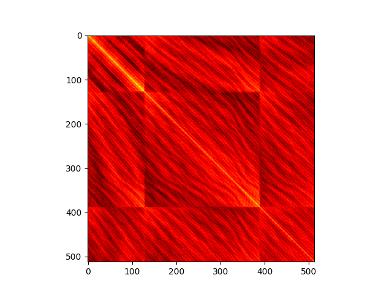

### Bert base cased
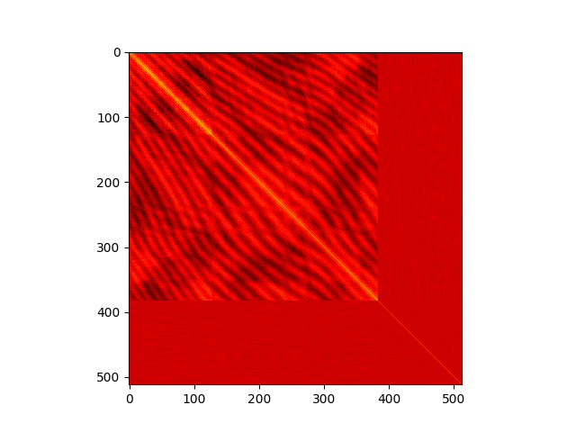

### Bert large cased
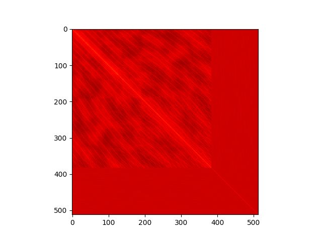

### Roberta base
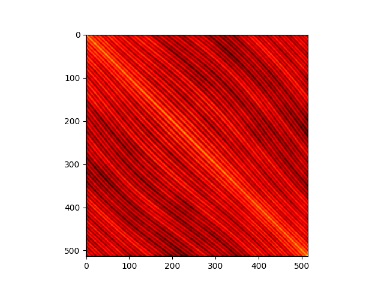

### Roberta large
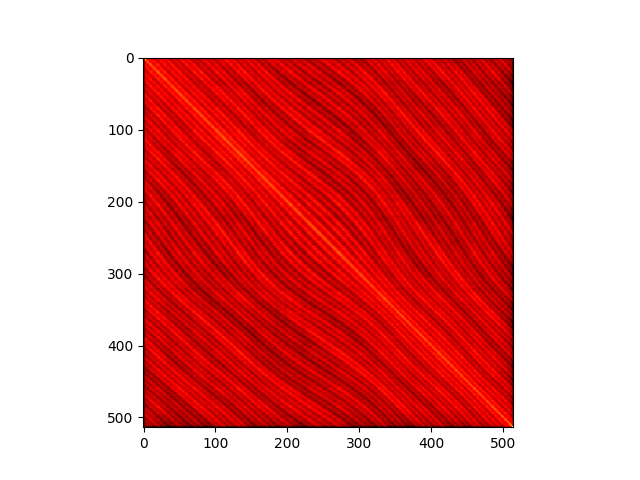

### Albert base v1
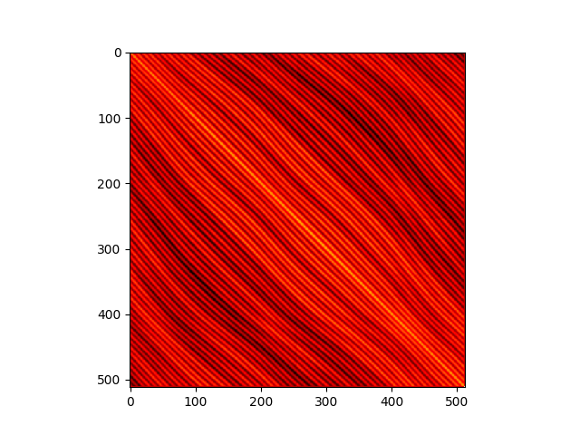

### Albert base v2
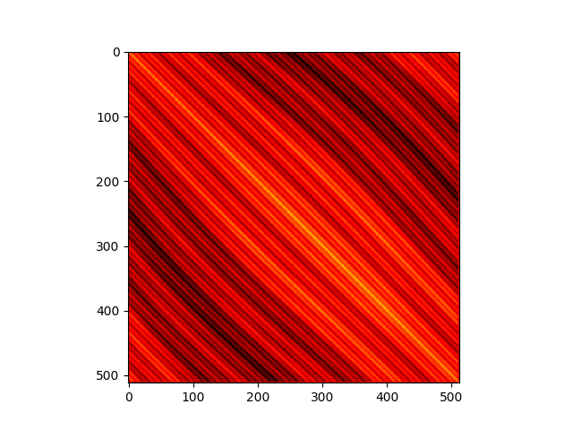

### Albert large v1

### Albert large v2
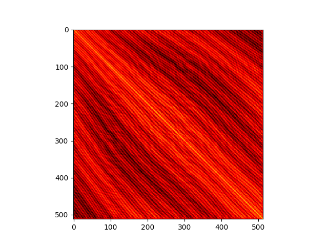

### Albert xlarge v1

### Albert xlarge v2
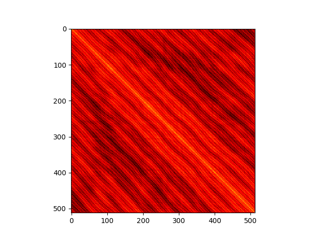

### Albert xxlarge v1
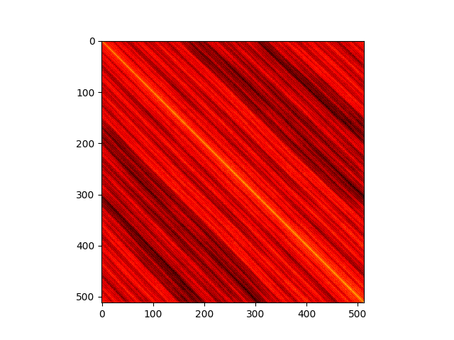

### Albert xxlarge v2
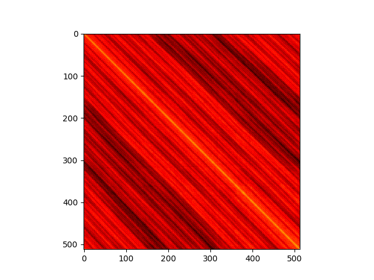

### Longformer base
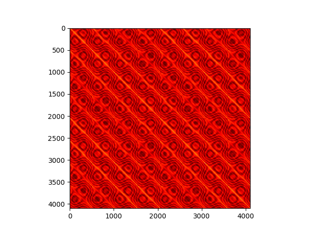

### Longformer base
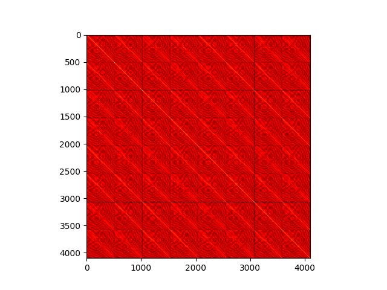

### KB Bert base swedish cased
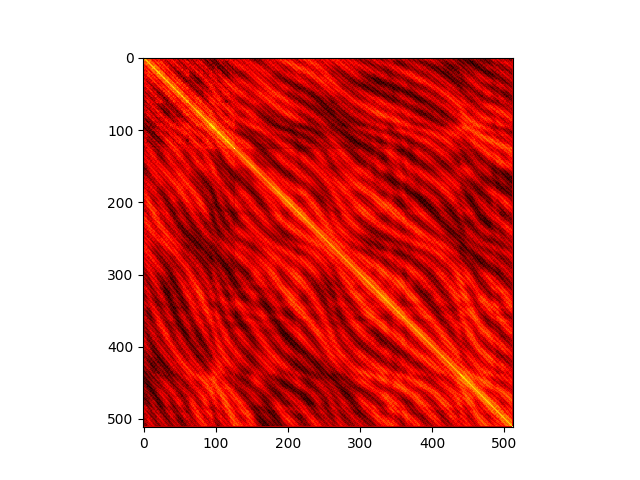

### KB Albert base swedish cased alpha
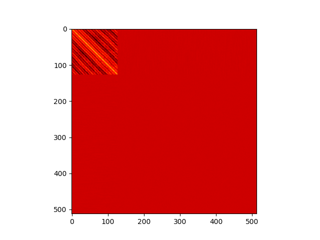
