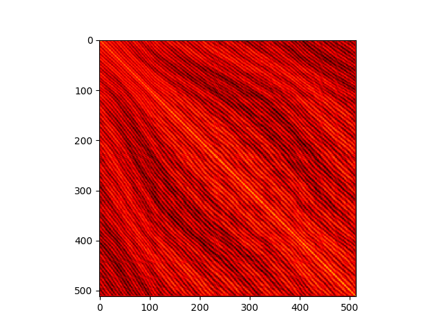

# TISA

This is the code for the article The Case for Translation-Invariant Self-Attention in Transformer-Based Language Models

Please cite this article as follows:
```
@inproceedings{wennberg-henter-2021-case,
    title = "The Case for Translation-Invariant Self-Attention in Transformer-Based Language Models",
    author = "Wennberg, Ulme  and
      Henter, Gustav Eje",
    booktitle = "Proceedings of the 59th Annual Meeting of the Association for Computational Linguistics and the 11th International Joint Conference on Natural Language Processing (Volume 2: Short Papers)",
    month = aug,
    year = "2021",
    publisher = "Association for Computational Linguistics",
    url = "https://aclanthology.org/2021.acl-short.18",
    doi = "10.18653/v1/2021.acl-short.18",
    pages = "130--140"
}
```

## Model

The TISA model is located in `model/tisa.py`

## Figures

### Bert base uncased


### Bert large uncased


### Bert base cased


### Bert large cased


### Roberta base


### Roberta large


### Albert base v1


### Albert base v2


### Albert large v1


### Albert large v2


### Albert xlarge v1


### Albert xlarge v2


### Albert xxlarge v1


### Albert xxlarge v2


### Longformer base


### Longformer base


### KB Bert base swedish cased


### KB Albert base swedish cased alpha


